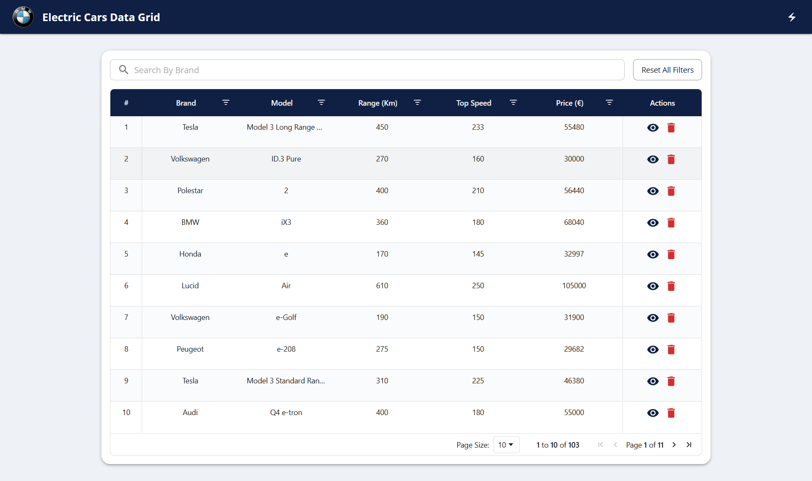
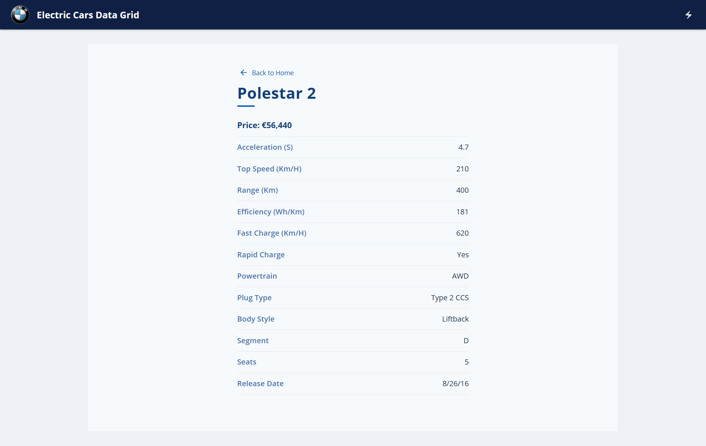

# 🚗 BMW Electric Car DataGrid App

A modern full-stack web application for exploring, searching, and managing electric car data. Built with React, AG Grid, Material UI, Node.js/Express, and MongoDB, following professional TypeScript and project structure standards.

---

## ✨ Features

- **Interactive Data Table**: Powerful AG Grid with sorting, filtering, pagination, and global search.
- **Modern BMW-Inspired UI**: Built with Material UI and custom styling.
- **Detailed Car View**: Human-friendly car details page for all specifications.
- **RESTful API**: Node.js/Express backend with robust, type-safe endpoints.
- **Data Import Automation**: CSV import script for easy data onboarding and cleaning.
- **TypeScript Everywhere**: Full stack type safety.
- **Modular Architecture**: Clean separation of concerns and reusable components.

---

## 🗂️ Project Structure

- **frontend/**
  - src/
    - api/
    - assets/
    - components/
    - pages/
    - styles/
    - types/
    - utils/
    - App.tsx
    - config.ts
    - ...
- **backend/**
  - src/
    - models/
    - routes/
    - controllers/
    - scripts/
  - ElectricCarData.csv
  - .env

---

## 🚀 Getting Started

### Prerequisites

- Node.js (18+ recommended)
- MongoDB Atlas account or local MongoDB instance

### 1. Backend Setup

| Step                        | Commands                                   |
|-----------------------------|--------------------------------------------|
| **Go to backend folder**    | `cd backend`                               |
| **Install dependencies**    | `npm install`                              |
| **Create `.env` file**      | `MONGODB_URI=your_mongodb_connection_string` |
| **Import data from CSV**    | `npm run import`       |
| **Build backend server**    | `npm run build`                              |
| **Start backend server**    | `npm start`                              |
| **Backend URL**             | [http://localhost:5000](http://localhost:5000) |

### 2. Frontend Setup

| Step                        | Commands                                   |
|-----------------------------|--------------------------------------------|
| **Go to frontend folder**   | `cd frontend`                              |
| **Install dependencies**    | `npm install`                              |
| **Create `.env` file**      | `VITE_API_URL=http://localhost:5000/api`   |
| **Start frontend server**   | `npm run dev`                              |
| **Frontend URL**            | [http://localhost:5173](http://localhost:5173) |

---

## 💡 How to Use

- Browse and search the electric car records
- Apply filters on any column to narrow results
- Click on the View icon to see full car specifications
- Use the Delete icon to remove a car with confirmation
- Pagination controls and row count are displayed at the bottom

---

## 🧠 Learnings and Challenges

- Working with real-world CSV data required handling nulls and formatting issues
- Customizing AG Grid to match Material UI styling took experimentation
- Maintaining type safety across backend and frontend improved code reliability
- Learned how to structure scalable full-stack apps using reusable components and modules

---

## 🛠️ Technologies Used

- Frontend: React, AG Grid, Material UI, Vite, TypeScript  
- Backend: Node.js, Express, MongoDB, Mongoose, TypeScript  

---

## 📸 Screenshots

---

This project is for educational purposes only.  

